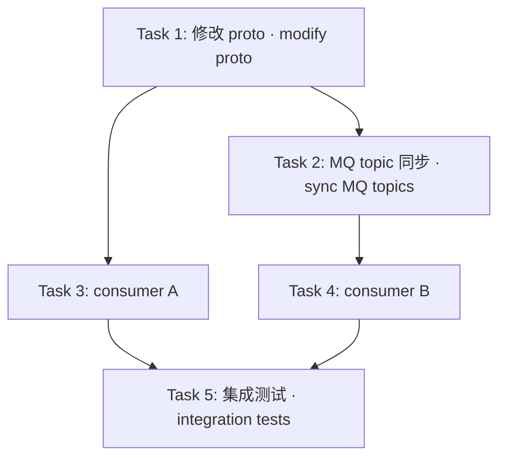

# PRD → Tasks

> 从 PRD 到可执行工程任务的结构化转化流水线。核心价值：**代码库感知的任务拆解** + **风险驱动的工作流路由**。
>
> A structured pipeline from PRD to executable engineering tasks. Core value: **codebase-aware task breakdown** + **risk-driven workflow routing**.

---

## 依赖 · Dependencies

本 skill 是**端到端开发流水线**的后半段。如果你还没有 PRD，先用 `/prd` skill 生成一份。

This skill is the **second half of an end-to-end development pipeline**. If you don't have a PRD yet, use the `/prd` skill to generate one first.

### 安装 `/prd` · Install `/prd`

```bash
npx skills add github/awesome-copilot@prd -g -y
```

> 来源 · Source: https://skills.sh/github/awesome-copilot/prd（17.8K installs，MIT License）

### 完整流水线 · Full Pipeline

```
想法 / 业务需求
       │
       ▼
  /prd  ──────────────────────────────────────────────────────────
  Phase 1: Discovery 访谈（问题 / 成功指标 / 约束）
  Phase 2: Analysis & Scoping（用户流 / Non-Goals）
  Phase 3: 生成 PRD 文档（Executive Summary / User Stories /
            Technical Specs / Risk Analysis）
       │
       │  产出：PRD 文档（Markdown）
       ▼
  /prd-to-tasks  ──────────────────────────────────────────────────
  Phase 0: PRD 摄取（粘贴 / 飞书链接 / 本地文件）
  Phase 1: 范围澄清 + 风险定级（🔴 / 🟡 / 🟢）
  Phase 2: 代码库深度扫描（受影响文件 / 接口 / DB / MQ）
  Phase 3: Spec 生成（设计文档 → docs/superpowers/specs/）
  Phase 4: 任务拆解（带路径 + 行号的可执行任务清单）
  Phase 5: 工作流路由（→ cross-verified / superpowers 序列 / direct）
       │
       ▼
  编码实现（由路由决定走哪条 superpowers 流程）
       │
       ▼
  代码审查 → 合并 → 上线
```

### 如何衔接 · How to Chain `/prd` → `/prd-to-tasks`

**Step 1**：调用 `/prd`，完成三阶段访谈，获得 PRD 文档。

```
/prd
```

`/prd` 结束后你会得到一份结构化 Markdown PRD，包含：Executive Summary、User Stories、Technical Specifications、Risks & Roadmap。

**Step 2**：将 PRD 内容喂给 `/prd-to-tasks`。有三种方式：

| 方式 | 操作 |
|------|------|
| **粘贴文本**（最常用）| `/prd-to-tasks` 后直接粘贴 PRD 全文 |
| **本地文件**（已保存 PRD） | `/prd-to-tasks docs/prd/my-feature.md` |
| **飞书链接**（PRD 在飞书） | `/prd-to-tasks https://feishu.cn/docx/xxx` |

**Step 3**：`/prd-to-tasks` 从 Phase 0 开始，摄取 PRD 后复述核心业务目标，等你确认后进入 Phase 1 范围澄清。

> **关键**：`/prd-to-tasks` 会根据风险定级（Phase 1.3）自动路由到对应的编码工作流，无需你手动选择后续步骤。

---

## 本 skill 解决什么问题 · What Problem This Skill Solves

通用的 spec-driven-development 写出来的任务是"实现用户登录功能 → 修改 UserService" — 落地时还要花大量时间找代码。

Generic spec-driven-development produces tasks like "implement user login → modify UserService" — which still require significant time to locate the actual code when executing.

本 skill 写出来的任务是：
> 在 `order-service/internal/service/booking/booking_service.go:142` 的 `CreateBooking` 方法中加入 feature flag 检查，flag key 为 `new_order_flow_enabled`，使用项目 KB（`~/.claude/prd-to-tasks/service-patterns.md`）中记录的 ID 生成 helper 创建新单据 ID，写入数据库，写后按项目缓存失效协议执行失效 — 然后跑项目约定的 `build` + `test` 命令。

This skill produces tasks like:
> In the `CreateBooking` method at `order-service/internal/service/booking/booking_service.go:142`, add a feature flag check with key `new_order_flow_enabled`, use the ID generation helper documented in your project's KB (`~/.claude/prd-to-tasks/service-patterns.md`) to create the new record ID, write to the database, then execute your project's cache invalidation discipline — then run your project's `build` + `test` commands.

---

## 6 阶段工作流 · 6-Phase Workflow

```
Phase 0:   PRD 摄取        → 读取文档 / 粘贴文本
           PRD Ingestion    → Read doc / paste text

Phase 1:   范围澄清与风险定级（门控：人工确认）
           Scope Clarity & Risk Classification (gate: human confirmation)

  Phase 1.0: PRD 合理性调研 → 拉取 Lark 关联文档 + 全量加载 KB + 代码定向探针
             PRD Feasibility  → Fetch referenced Lark docs + full KB load + targeted codebase probe

  Phase 1.1–1.4: 识别服务、PM 清单、风险定级（基于 1.0 调研结论）
                  Identify services, PM checklist, risk classification (informed by 1.0)

Phase 2:   代码库深度扫描  → 找受影响的文件、接口、DB 表（全量）
           Deep Codebase Scan → Find affected files, interfaces, DB tables (comprehensive)

Phase 3:   Spec 生成       → 结构化设计文档（门控：人工确认）
           Spec Gen         → Structured design doc (gate: human confirmation)

Phase 4:   任务拆解        → 带路径 + 模式引用的可执行任务（门控：人工确认）
           Task Breakdown   → Executable tasks with paths + pattern references (gate: human confirmation)

Phase 5:   工作流路由      → 决定接下来走哪个 superpowers 流程
           Workflow Route   → Decide which superpowers flow to follow next
```

每个门控阶段必须等人工确认后才进入下一阶段。
Each gated phase must wait for explicit human confirmation before proceeding.

---

## 知识库 · Knowledge Base

`repo-map`、`service-patterns` 等映射文件**不是硬编码在本 skill 里的**——它们是用户/团队可演进的知识库。原因：每家公司、每个团队的代码仓库布局和内部代码模式都不同。

`repo-map`, `service-patterns`, etc. are **not hardcoded in this skill** — they are user/team-evolvable knowledge bases. Reason: every company's code layout and internal patterns are different.

### 加载顺序 · Loading Order

首找优先；同 key 项目级覆盖用户级。First-found wins; project-level overrides user-level.

```
1. <CWD>/.claude/prd-to-tasks/*.md       # 项目级 · Project-level (team-shared via git)
2. ~/.claude/prd-to-tasks/*.md           # 用户级 · User-level (cross-project personal KB)
3. <skill>/references/*.md              # skill 仓库自带 seed · Bundled seed (read-only, industry-neutral)
```

### KB 目录文件清单（按需扩展）· KB File List (extensible)

skill 在加载时枚举 KB 目录下所有 `*.md` 文件。常见但不限于：
The skill enumerates all `*.md` files in the KB directory at load time. Common but not limited to:

| 文件 File | 内容 Content | 何时读 When read |
|----------|-------------|------------------|
| `repo-map.md` | 需求信号 → 受影响服务/仓库 · Requirement signal → affected services/repos | Phase 1.0（PRD 可行性验证）+ Phase 1.1 |
| `service-patterns.md` | 内部代码模式（ID 生成、缓存失效、MQ topic 注册 等）· Internal patterns | **Phase 1.0**（验证 PRD 与现有模式兼容性 · validate PRD compatibility with existing patterns）+ Phase 4 task checklist |
| `<custom>.md` | 用户自定义（例 `state-machine-conventions.md`、`team-owners.md`）· User-custom | 全局，skill 自行判断何时引用 |

### Bootstrap 协议 · Bootstrap Protocol

Phase 0 摄取完 PRD 后，本 skill 检测 KB 目录：
After Phase 0 PRD ingestion, this skill detects the KB directory:

- 若 `<CWD>/.claude/prd-to-tasks/` 或 `~/.claude/prd-to-tasks/` 存在 → 直接使用
  If `<CWD>/.claude/prd-to-tasks/` or `~/.claude/prd-to-tasks/` exists → use directly
- 若都不存在 → 提示用户：

```
KB 目录未找到。建议运行：
  mkdir -p ~/.claude/prd-to-tasks
  cp ~/.claude/skills/prd-to-tasks/references/*.md ~/.claude/prd-to-tasks/
  # 如本 skill 通过 plugin 安装，路径形如 ~/.claude/plugins/cache/<plugin>/skills/prd-to-tasks/references/
然后按你的代码库改写。
或选择跳过（继续但 Phase 1.1 / Phase 4 检查项能力会受限）。

KB directory not found. Recommended:
  mkdir -p ~/.claude/prd-to-tasks
  cp ~/.claude/skills/prd-to-tasks/references/*.md ~/.claude/prd-to-tasks/
  # If installed via plugin: ~/.claude/plugins/cache/<plugin>/skills/prd-to-tasks/references/
Then customize for your codebase.
Or skip (continue but Phase 1.1 / Phase 4 will have reduced capability).
```

加载完成后**打印实际生效的 KB 路径列表**给用户，便于发现 path 错位。
After loading, **print the effective KB path list** to the user for path-error detection.

### 演进协议（重述 Phase 2.3）· Evolution Protocol (recap of Phase 2.3)

- 用户必须**显式同意**才会写入 KB · Explicit user approval required for KB writes
- 本 skill **永不静默写入 KB** · This skill **never silently writes to KB**
- 写入前显示完整 diff · Show full diff before write

---

### Phase 0: PRD 摄取 · PRD Ingestion

接收 PRD 的三种形式：
Three ways to receive a PRD:

**A. Feishu/Lark 文档 URL · Feishu/Lark Doc URL**（`feishu.cn/docx/`、`feishu.cn/wiki/` etc.）
```bash
lark-cli docs +fetch --doc "<url>"
```
读取后提取：功能目标、验收标准、接口设计、状态机描述、上线时间节点。
After reading, extract: functional goals, acceptance criteria, interface design, state machine description, launch timeline.

**B. 粘贴的文本 · Pasted Text**：直接解析，梳理结构。
Parse directly and organize the structure.

**C. 本地文件路径 · Local File Path**：用 Read 工具读取。
Use the Read tool to read.

摄取完成后用 2-3 句话复述你理解的**核心业务目标**，让用户确认理解无误再继续。
After ingestion, summarize the **core business goal** in 2-3 sentences and ask the user to confirm your understanding before proceeding.

---

### Phase 1: 范围澄清与风险定级 · Scope Clarification & Risk Classification

#### 1.0 PRD 合理性调研 · PRD Feasibility Research

在开始范围评估前，主动收集上下文，判断 PRD 的技术可行性。**不调研就评估 = 盲目评估**：此时缺乏代码依据，风险定级可能失准，PM 清单中很多本可自答的问题会白白浪费用户时间。

Before scope assessment, proactively gather context to evaluate PRD technical feasibility. **Evaluating without research = blind assessment**: risk classification lacks code evidence, and PM checklist items that could be self-answered will waste the user's time.

**调研三层，按顺序执行 · Three research layers, execute in order:**

**A. Lark 文档调研 · Lark Document Research**

扫描 PRD 正文，提取所有 Lark 链接（`feishu.cn/docx/`、`feishu.cn/wiki/` 等），逐一拉取：
Scan PRD body for all Lark links, fetch each:

```bash
lark-cli docs +fetch --doc "<referenced-url>"
```

重点提取：历史技术方案与设计决策、相关接口文档、前置 PRD 中已有的约束与结论。
Extract: historical tech decisions, related API docs, constraints from predecessor PRDs.

**B. 知识库全量加载 · Full KB Load**

读取 KB 目录下**所有** `.md` 文件（含 `service-patterns.md`，不只是 `repo-map.md`）：
Load **all** `.md` files in KB directory (including `service-patterns.md`, not just `repo-map.md`):

```
<CWD>/.claude/prd-to-tasks/*.md  →  repo-map + service-patterns + 所有自定义
~/.claude/prd-to-tasks/*.md       →  用户级 KB
```

重点关注：PRD 所述的业务流程，与 KB 中记录的现有代码模式（ID 生成规范、缓存失效协议、MQ topic 注册方式等）是否兼容。
Focus: whether the business flows described in PRD are compatible with existing code patterns in KB.

**C. 代码库定向探针 · Targeted Codebase Probe**

对 PRD 的**核心技术声明**做定向探查。目标是**验证 PRD 假设**，不是全量扫描（全量扫描在 Phase 2）。

Probe the codebase for PRD's **core technical claims**. Goal: **validate PRD assumptions**, NOT comprehensive scanning (that's Phase 2).

如 CWD 包含相关代码 → 直接探查，无需等用户提供路径。否则询问关键仓库路径（用户可回答"稍后在 Phase 2 再提供"，此时该假设标记为 ⚠️ 待验）。

If CWD contains relevant code → probe directly, no need to ask for paths. Otherwise ask for key repo paths (user may say "provide in Phase 2" — that assumption is then marked ⚠️ pending).

```bash
# 针对 PRD 声明的核心 symbol/模块做定向 grep · Targeted grep for core symbols/modules from PRD
grep -r "<prд-mentioned-symbol>" <repo>/internal/ --include="*.go" -l

# 检查 PRD 涉及的状态机/枚举是否已存在 · Check if state machines/enums from PRD already exist
grep -r "type.*Status\|State\b" <repo>/internal/ --include="*.go" -l
```

**1.0 产出：PRD 假设验证报告 · PRD Assumption Validation Report**

对 PRD 中每个关键假设，标注验证状态：
For each key PRD assumption, mark validation status:

```
PRD 假设验证 · PRD Assumption Validation:

✅ 假设成立：<assumption> — 代码/KB/Lark 已有 <symbol>（路径/来源 · path/source: <ref>）
⚠️ 假设待验：<assumption> — 路径未确认，将在 Phase 2 深查
❌ 假设存疑：<assumption> — 与现有代码/KB/Lark 记录冲突（<具体冲突点>）

发现的潜在风险 · Discovered potential risks:
⚠️ <risk> — <why this matters>
```

**调研结论影响下游 · Research conclusions inform downstream:**
- ✅ 多 → Phase 1.2 PM 清单中可自答项增多，Open Questions 减少
- ❌ 多 → 可能在 Phase 1 HARD-GATE 前需先拉相关人讨论，或调整风险定级
- 严重 ❌（PRD 与代码现实根本矛盾）→ **暂停流程**，向用户发出明确警告，确认是否继续

More ✅ → More PM checklist items self-answerable, fewer Open Questions  
More ❌ → May need stakeholder discussion before Phase 1 HARD-GATE, or adjust risk level  
Severe ❌ (PRD fundamentally contradicts code reality) → **Pause pipeline**, warn user explicitly, confirm whether to continue

#### 1.1 识别受影响的服务 · Identify Affected Services

参考 `references/repo-map.md` 把需求映射到具体仓库和服务：
Reference `references/repo-map.md` to map requirements to specific repos and services:

| 典型需求信号 · Typical Requirement Signal | 受影响的服务 · Affected Services |
|------------------------------------------|--------------------------------|
| 用户下单、购物车、商品详情 · User checkout, cart, product detail | `bff-service` |
| 订单状态、退款、钱包 · Order status, refunds, wallet | `order-service` (order-api-service / refund-service) |
| 履约、资源交付 · Fulfillment, resource delivery | `fulfillment-service`（参考 KB `repo-map.md` · see KB） |
| 供应商履约、资源交付 · Supplier fulfillment, resource delivery | `fulfillment-service` |
| 优惠券、库存 · Vouchers, inventory | `voucher-service` |
| 支付、收款 · Payments, collections | `payment-service` |
| 跨服务共享模型 / proto · Cross-service shared models / proto | `shared-models` |

#### 1.2 PM 范围澄清清单 · PM Scope-Clarity Checklist

在问任何技术问题之前，先把你能从 **PRD + Phase 1.0 调研结论（Lark 文档 + KB + 代码探针）** 中自行推断的信息全列出来（"我假设..." 格式），然后只问**无法自行判断**的事项。1.0 调研结论越充分，此处 Open Questions 越少。

Before asking any technical questions, list everything you can infer from **PRD + Phase 1.0 research (Lark docs + KB + codebase probe)** ("I assume..." format), then only ask about what you **cannot determine yourself**. The richer the Phase 1.0 findings, the fewer Open Questions here.

逐项填写或注明 "PRD 已覆盖"。任何空项必须形成 Open Question 提给用户。
Fill in each item or mark "covered by PRD". Any blank must become an Open Question to the user.

| # | 维度 · Dimension | 输出要求 · Output Requirement |
|---|------------------|------------------------------|
| 1 | **JTBD** (Job-to-be-done) | 谁在什么场景下用，要解决什么痛点（不是"实现 X 功能"，而是"让 Y 用户在 Z 情境下能做到 W"） · Who uses it in what context, what pain it solves (not "implement X", but "enable Y user in Z context to do W") |
| 2 | **In scope** | 本期必做的可枚举能力清单 · Enumerable capabilities required this iteration |
| 3 | **Not Doing** | 显式排除的能力（防止范围蔓延） · Explicitly excluded capabilities (scope-creep guard) |
| 4 | **Deferred to v2** | 推迟到下一版的能力 + 推迟理由 · Capabilities deferred + reason |
| 5 | **成功指标 · Success Metrics** | 业务指标（如转化率 +X%）+ 技术指标（如 p99 < Yms），均需可量化 · Business metric (e.g. conversion +X%) + technical metric (e.g. p99 < Yms), both quantifiable |
| 6 | **使用者主路径 · User Happy Path** | happy path 的用户操作序列 · User operation sequence on happy path |
| 7 | **极端失败模式 · Worst-case Failure** | 最坏情况：什么会坏 + 谁/什么会受伤 + 影响半径 · Worst case: what breaks, who/what is harmed, blast radius |
| 8 | **回滚指标 · Rollback Trigger** | 哪个 metric 超阈值触发回滚 + 谁决定 + 耗时 · Which metric anomaly triggers rollback, who decides, time-to-rollback |
| 9 | **上下游依赖 · Upstream/Downstream** | 其他团队/服务的同步要求 · Synchronization requirements with other teams/services |
| 10 | **合规/审计 · Compliance/Audit** | PII / GDPR / 资金审计 / 操作日志要求 · PII, GDPR, financial audit, operation log requirements |

#### 1.3 风险定级 · Risk Classification

定级结果决定后续工作流路由：
The classification result determines the downstream workflow routing:

| 风险层级 · Risk Level | 判定标准 · Criteria | 后续工作流 · Downstream Workflow |
|----------------------|--------------------|---------------------------------|
| 🔴 **Critical** | 资金流 / 退款 / 余额 / 状态机 / 分布式锁 / 跨服务 MQ 协议 / online schema 迁移 · Money flow / refunds / balance / state machine / distributed locks / cross-service MQ protocol / online schema migration | → `cross-verified-feature-development`（内含完整 9 阶段 superpowers 序列）|
| 🟡 **High** | 估算 ≥ 3 人日 / 多仓库联动 / 核心订单路径改造 · Estimated ≥ 3 person-days / multi-repo coordination / core order path changes | → superpowers 标准序列：`brainstorming` → `writing-plans` → `test-driven-development` + `subagent-driven-development` → `systematic-debugging` → `verification-before-completion` → `requesting-code-review` → `receiving-code-review` → `finishing-a-development-branch`（验收不通过回 writing-plans；review 重大问题回 debugging）|
| 🟢 **Standard** | 纯新增接口 / 无状态机语义 / 单仓库 / < 3 人日 · Pure new endpoints / no state machine semantics / single repo / < 3 person-days | → `direct`（用户直接读 spec + 任务清单实施 · user reads spec + tasks and implements directly） |

**Phase 1 输出格式 · Phase 1 Output Format:**

```
我的初步判断（基于 PRD + Phase 1.0 调研：Lark 文档 + KB + 代码定向探针）
My initial assessment (based on PRD + Phase 1.0 research: Lark docs + KB + targeted codebase probe):
[每条用 "我假设 ..." 开头 · Each starts with "I assume ..."]

仍需你确认的 Open Questions · Still need your confirmation:
[只列 PM 清单中我无法自答的项 · Only list items I cannot self-answer from the PM checklist]

风险定级初判 · Initial risk classification: 🔴 Critical
[理由 · Reason: 触发 Phase 1.3 矩阵第 1 行（资金流 / 退款 / 余额）]
[考虑过的备选 · Alternatives considered: 🟡 High, but rejected because lacks cross-service contract change]
```

记录"考虑过的备选定级 + 排除理由"是事后回看"为什么走了 cross-verified-feature-development"时的审计线索。
Recording "considered alternative classification + rejection reason" provides an audit trail for retrospective review.

**呈现定级结果，等用户确认再继续。· Present the classification result and wait for user confirmation before proceeding.**

#### 1.4 Phase 1 自检 checklist · Self-check before gate

提交给用户前自动跑：
Run automatically before presenting to user:

- [ ] 用了 Phase 1.3 矩阵的具体风险层级（🔴/🟡/🟢）和判定标准作为定级理由 · Cited a specific Phase 1.3 risk level (🔴/🟡/🟢) and its criteria as the rationale
- [ ] 至少考虑了 1 个备选定级并写出排除理由 · Considered at least 1 alternative classification with rejection reason
- [ ] 🔴 触发关键词（资金 / 状态机 / MQ / schema / 锁 / 跨服务契约）显式列出 · 🔴 trigger keywords explicitly listed
- [ ] PM 检查清单 10 项无未答项（已答 or 已转 Open Question） · All 10 PM checklist items answered or converted to Open Question

任何 ❌ 必须自动尝试修复或显式 acknowledge 才能进入下一阶段。
Any ❌ must be auto-fixed or explicitly acknowledged before proceeding.

<HARD-GATE>
不得进入 Phase 2，除非用户**显式**输入有效批准信号。
有效信号：「approve Phase 1」/「确认 Phase 1」/「Phase 1 OK，继续」。
无效信号（仅为会话寒暄，禁止当作批准）：「看起来不错」「continue」「嗯」「ok」「好的」「就这样」。

Do NOT proceed to Phase 2 unless the user provides an **explicit** valid approval signal.
Valid signals: "approve Phase 1" / "确认 Phase 1" / "Phase 1 OK, continue".
Invalid signals (conversational acknowledgements, NOT approval): "looks good" / "continue" / "ok" / "好的" / "嗯" / "就这样".
</HARD-GATE>

---

### Phase 2: 代码库深度扫描 · Deep Codebase Scan

Phase 1.0 已完成定向探针（验证 PRD 假设）。Phase 2 的目标是**全量影响面梳理**：找出所有受影响的文件、接口、DB 表、MQ topic，而不仅是验证 PRD 的核心声明。

Phase 1.0 already ran targeted probes (PRD assumption validation). Phase 2 goal is **comprehensive impact mapping**: find all affected files, interfaces, DB tables, MQ topics — not just validating the PRD's core claims.

在扫描之前，确认仓库路径（如 Phase 1.0 中已获取部分路径，此处补充完整）。不要自行假设目录位置。
Before scanning, confirm repo paths (supplement any paths already gathered in Phase 1.0). Do not assume directory locations.

#### 2.0 确认仓库目录 · Confirm Repo Directories

根据 Phase 1 识别的受影响服务，向用户提问（Phase 1.0 中已确认的路径无需重复询问）：
Based on the affected services identified in Phase 1, ask the user (skip paths already confirmed in Phase 1.0):

```
我需要扫描以下仓库，请告诉我它们在你本地的路径：
I need to scan the following repos. Please tell me their local paths:

- <service-a>          → 路径 path？（例 e.g. ~/code/<service-a>）
- <service-b>          → 路径 path？（例 e.g. ~/code/<service-b>）
- <shared-contracts>   → 路径 path？（如有 proto 变更 · if proto changes needed）
（具体服务清单从你的 KB `repo-map.md` 中 Phase 1.1 已识别 · concrete service list comes from Phase 1.1's identification using your KB's `repo-map.md`）

如果多个仓库在同一个父目录下（例如都在 ~/code/），
If multiple repos share a parent directory (e.g. all under ~/code/),
告诉我父目录就够了，我会自动定位子目录。
just tell me the parent directory — I'll locate subdirectories automatically.
```

用户确认路径后再开始扫描。如果用户说"我不确定"或"你自己找"，用 `find ~ -name "go.mod" -maxdepth 5` 辅助定位，但结果要让用户确认再扫。
Start scanning only after the user confirms paths. If the user says "I'm not sure" or "find it yourself", use `find ~ -name "go.mod" -maxdepth 5` to help locate repos, but confirm results with the user before scanning.

#### 2.1 扫描优先级 · Scan Priority

**工具优先级 · Tool Priority**：

如目标语言的 LSP 服务可用（如 Go 的 `gopls`、Python 的 `pyright`、TypeScript 的 `typescript-language-server`），**优先**用 LSP 的 references / implementations / call hierarchy 调用替代 grep — LSP 能解析 symbol 语义，grep 容易漏识别接口实现关系。LSP 不可用时降级为下面的 grep + find 组合。如当前 harness 提供 `LSP` 工具（如 Claude Code），调用其 `references` / `implementations` / `call_hierarchy` action；不可用时降级到下面的 grep + find。

If target-language LSP is available (e.g. `gopls` for Go, `pyright` for Python, `typescript-language-server` for TypeScript), **prefer** LSP `references` / `implementations` / `call hierarchy` calls over grep — LSP resolves symbol semantics, while grep often misses interface-implementation relations. Fall back to the grep + find combo below if LSP is unavailable. If the current harness exposes an `LSP` tool (e.g. Claude Code), call its `references` / `implementations` / `call_hierarchy` actions; fall back to the grep + find block below if unavailable.

```bash
# 1. 找入口 handler（接口定义）· Find entry handlers (interface definitions)
grep -r "func.*Handler\|router\.\(GET\|POST\|PUT\)" <repo>/cmd/ --include="*.go" -l

# 2. 找受影响的 Service interface · Find affected Service interfaces
grep -r "type.*Service interface" <repo>/internal/ --include="*.go" -l

# 3. 找 DB 访问层（了解现有 schema）· Find DB access layer (understand existing schema)
grep -r "db\.WriteDB\|db\.ReadDB\|sqlx" <repo>/internal/ --include="*.go" -l

# 4. 找 MQ topics（跨服务消息）· Find MQ topics (cross-service messages)
# Find MQ topic registries. Seed pattern below — adapt the symbol name + path + file ext to your codebase.
grep -rE 'Topics\b|topic\.' <repo>/<your-mq-path>/ --include='*.go'

# 5. 找 proto 定义（跨服务接口契约）· Find proto definitions (cross-service contracts)
find <repo> -name "*.proto" | head -20
```

#### 2.2 扫描产出 · Scan Output

整理出一张**受影响范围表**（含 confidence 列）：
Produce an **affected scope table** (with confidence column):

| 文件 File | 影响类型 Impact | 改动点 Change | Confidence |
|----------|----------------|--------------|------------|
| `<service-a>/internal/service/<domain>/<domain>_service.go` | 修改 modify | `CreateXxx()`: 加入 feature flag 分支 · add feature flag branch | 高 high — directly named in PRD |
| `<service-a>/internal/<mq-path>/topic.go` | 修改 modify | MQ topic 注册表需同步新增 topic · MQ topic registries need new topic in sync | 中 medium — pattern-matched from KB |
| `<shared-contracts-repo>/proto/<domain>.proto` | 修改? modify? | 待确认是否需要新增字段 · pending confirmation on new field | 低 low — needs user input |
| `<service-b>/internal/service/<domain>_v2/` | 新增消费者 new consumer | new file required | 高 high |

`confidence` 列三个值 · Three values:
- **高 / high**：PRD 直接点名、或 KB 中有精确模式匹配 · PRD directly names it, or exact KB pattern match
- **中 / medium**：模式推断，需要 Phase 3 spec 中再确认 · Inferred from pattern, confirm in Phase 3 spec
- **低 / low**：仅初步假设，须形成 Open Question · Tentative assumption, must become Open Question

扫描过程中发现的**隐性风险**（如发现并发写、无幂等保护、旧版本兼容问题）立刻标注 ⚠️ 并纳入 Phase 3 的不变式清单。
Any **hidden risks** discovered during scanning (e.g. concurrent writes, missing idempotency protection, backward compatibility issues) must be flagged immediately with ⚠️ and added to the Phase 3 invariants list.

#### 2.3 KB 演进协议 · Knowledge Base Evolution Protocol

扫描结束后，对每个**未在当前 KB 中**找到对应映射的服务/模式，列出"候选新 KB 条目"清单：

After scanning, for each service/pattern not found in the currently loaded KB, list a "candidate new KB entry":

```
扫描发现以下新映射，KB 中尚无对应条目。要追加到 ~/.claude/prd-to-tasks/repo-map.md 吗？
Discovered the following new mappings; no corresponding entries in KB. Append to ~/.claude/prd-to-tasks/repo-map.md?

候选条目 · Candidate entries:
- "<requirement-signal>" → <service-name>  [user 确认 add / skip]
- "<another-signal>" → <another-service>   [user 确认 add / skip]
```

**规则 · Rule**：
- 用户必须**显式同意**才会写入（与 HARD-GATE 协议一致）· User must give explicit approval (same as HARD-GATE protocol)
- 本 skill **永不静默写入 KB** · This skill **never silently writes to KB**
- 写入时显示完整 diff 给用户 · Show full diff to user before write
- 默认写入 `~/.claude/prd-to-tasks/`（用户级）；如检测到项目级 `.claude/prd-to-tasks/` 存在且更适合，询问写哪一层 · Default write target is user-level; if project-level KB exists and seems more appropriate, ask which layer to write

---

### Phase 3: Spec 生成 · Spec Generation

基于摄取的 PRD + 代码扫描结果，生成结构化设计文档。
Based on the ingested PRD + codebase scan results, generate a structured design document.

**默认保存到 · Default save path**：`docs/superpowers/specs/YYYY-MM-DD-<feature>-design.md`（以 CWD 为根 · rooted at CWD）。

下游 skill 凭固定路径取货（参见 Phase 5 路由 hand-off 契约）。
Downstream skills consume by fixed path (see Phase 5 routing hand-off contract).

**Spec 模板 · Spec Template:**

```markdown
---
feature: <kebab-case-name>
prd-source: lark://docx/xxx 或 docs/prd/xxx.md 或 inline
risk-level: 🔴 Critical | 🟡 High | 🟢 Standard
affected-repos: [repo-a, repo-b]
spec-status: draft | approved | superseded   # HARD-GATE 通过后请手动将状态改为 approved · manually update to `approved` after HARD-GATE pass
created: YYYY-MM-DD
owner: <handle-or-email>
---

# Spec: <Feature Name>

## 业务目标 · Business Goal
[PRD 核心目标 + 验收标准 · PRD core objectives + acceptance criteria]

## 受影响的服务与仓库 · Affected Services & Repos
| 服务 Service | 仓库 Repo | 影响类型 Impact Type |
|-------------|----------|---------------------|

## 技术方案 · Technical Approach
[核心技术路径。每个关键决策点写明：选了什么，为什么不选备选方案
 Core technical path. For each key decision point: what was chosen, why alternatives were rejected]

## 边界 · Boundaries

### Always do · 必做（不需要再问 · no further confirmation needed）
- B-Always-1: ... (→ 技术方案 §X · backref to tech-approach decision)
- B-Always-2: ...

### Ask first · 先问再做（人在回路 · human-in-the-loop）
- B-AskFirst-1: ... (→ 技术方案 §X · backref to tech-approach decision)

### Never do · 严禁（红线 · red line）
- B-Never-1: ... (→ 技术方案 §X · backref to tech-approach decision)

> **Boundaries vs 不变式 · Boundaries vs Invariants**: Invariants = 系统/数据状态永远成立的命题（如"同一 booking_id 最多一次资金变动"）。Boundaries = agent 应执行/可执行/不可执行的**动作**。资金安全相关的命题可能两者都涉及——优先归入 Invariants（描述状态命题），Never-do 仅列对应的禁止动作。
>
> Invariants = propositions that always hold over system/data state. Boundaries = **actions** an agent should perform / may perform with human-in-the-loop / must not perform. Financially-sensitive items may touch both — prefer Invariants for the state proposition; Never-do should list only the forbidden corresponding action.

(每条带 ID，用于 Phase 4 task 反向引用 · Each entry has an ID for Phase 4 task back-references)

## API 契约变更 · API Contract Changes
[如有新增/修改接口 · If any new/modified interfaces]

## 数据模型变更 · Data Model Changes
[DB schema diff / proto field 变更 · DB schema diff / proto field changes]

## 不变式清单 · Invariants
- I-1: ... (→ 技术方案 §X · backref to tech-approach decision)
- I-2: ...
(每条带 ID，用于 task 反向引用 · Each entry has an ID for task back-references)

## 失败模式分析 · Failure Mode Analysis
[至少 4 种：正常路径崩溃 / 重试覆盖 / 并发竞态 / 下游超时
 At least 4: happy-path crash / retry idempotency / concurrent race / downstream timeout]

## 部署策略 · Deployment Strategy
[ ] 全量 Full rollout
[ ] Feature Flag（key: ___）
[ ] 灰度 Canary（比例 percentage: ___）
[ ] 双写切换 Dual-write switch

## 风险层级 · Risk Level
🔴 Critical / 🟡 High / 🟢 Standard（见 Phase 1.3 · see Phase 1.3）

## 回滚标准 · Rollback Criteria
[什么指标异常时触发回滚，谁来决定 · Which metric triggers rollback, who decides]

## 成功标准 · Success Criteria
[具体可测量的完成条件 · Specific measurable completion conditions]

## 遗留问题 · Open Questions

| # | 问题 Question | 影响 Impact | Owner | Deadline | 状态 Status |
|---|--------------|------------|-------|----------|------------|
| Q1 | ... | ... | @user | YYYY-MM-DD | open |

（状态 Status 枚举 · enum: `open` | `answered` | `deferred`）
```

#### 3.1 Phase 3 自检 checklist · Self-check before gate

写完 spec 后、展示给用户前，自动跑：
After writing the spec, before showing to user, run automatically:

- [ ] Placeholder 扫描：无 "TBD" / "TODO" / "待确认" / "??"  · Placeholder scan
- [ ] 内部一致性：技术方案 ↔ API 契约 ↔ 数据模型 三处无矛盾 · Internal consistency
- [ ] 范围一致性：Boundaries 三段 ↔ JTBD + In/Not Doing/v2 无矛盾 · Scope consistency
- [ ] 风险定级与 "风险层级" 节描述一致 · Risk level consistency
- [ ] 每条 Boundary / Invariant 至少映射到 1 个技术决策 · Every Boundary/Invariant maps to ≥1 tech decision
- [ ] Open Questions 无 owner 缺失项；无 deadline 缺失项 · Open Questions have owners + deadlines
- [ ] frontmatter 完整：feature / prd-source / risk-level / affected-repos / spec-status / created / owner · Frontmatter complete (all 7 fields)

任何 ❌ 先自动尝试修复；不能修复的转为新 Open Question 提给用户。
Any ❌ — auto-fix first; if unfixable, convert to a new Open Question for user.

<HARD-GATE>
不得进入 Phase 4，除非用户**显式**输入有效批准信号。
有效信号：「approve Phase 3」/「确认 Phase 3」/「Phase 3 OK，继续」。
无效信号（仅为会话寒暄，禁止当作批准）：「看起来不错」「continue」「嗯」「ok」「好的」「就这样」。

Do NOT proceed to Phase 4 unless the user provides an **explicit** valid approval signal.
Valid signals: "approve Phase 3" / "确认 Phase 3" / "Phase 3 OK, continue".
Invalid signals: "looks good" / "continue" / "ok" / "好的" / "嗯" / "就这样".
</HARD-GATE>

---

### Phase 4: 任务拆解 · Task Breakdown

Spec 确认后，拆解为**可独立执行、可独立验证**的工程任务。
After spec is confirmed, break down into **independently executable, independently verifiable** engineering tasks.

**默认保存到 · Default save path**：`docs/superpowers/plans/YYYY-MM-DD-<feature>-tasks.md`（以 CWD 为根 · rooted at CWD）。

Plan 文件顶部必须带机读 frontmatter（Phase 5 路由 hand-off 契约的实际载体 · the actual carrier of the Phase 5 routing hand-off contract）。

#### 4.0 Plan 文件 frontmatter · Plan File Frontmatter

Plan 文件最开头必带 YAML frontmatter，下游 skill 凭此路由：

```yaml
---
feature: <kebab-case-name>
risk-level: 🔴 Critical | 🟡 High | 🟢 Standard
routed-to: cross-verified-feature-development | superpowers:writing-plans | direct
spec: ../specs/YYYY-MM-DD-<feature>-design.md
routed-rationale: |
  Selected <skill> because [...]
  Considered <alternative> but rejected: [...]
  Expected cost: [...]
plan-status: ready-for-execution
phase-gate-approvals:
  phase-1: { approved-at: "YYYY-MM-DD HH:MM", phrase: "approve Phase 1" }
  phase-3: { approved-at: "YYYY-MM-DD HH:MM", phrase: "确认 Phase 3" }
  phase-4: { approved-at: "YYYY-MM-DD HH:MM", phrase: "Phase 4 OK" }
created: YYYY-MM-DD
created-by: <handle-or-email>
---
```

紧随 frontmatter 之后是**任务 DAG**（mermaid）：
Immediately after frontmatter comes the **task DAG** (mermaid):



DAG 让用户一眼看出关键路径和可并行批次，也是 `superpowers:subagent-driven-development` 的天然输入。
The DAG shows critical path + parallelizable batches at a glance, and is the natural input for `superpowers:subagent-driven-development`.

#### 4.1 任务格式 · Task Format

每个任务必须包含：
Each task must include:

```markdown
### Task N: <动词 + 宾语 · verb + object>

**仓库 Repo**: <service-name>
**文件 File**: `path/to/file.ext`（如修改现有文件带行号 · with line range if modifying existing file）
**类型 Type**: 新增 add / 修改 modify / 删除 delete / 契约变更 contract change
**尺寸 Size**: XS / S / M / L / XL
**拆分被否决的理由 · Split rejection reason** (XL only): <reason — required if Size=XL>
**spec-refs**:
  - section: "技术方案 · Technical Approach"   # 引用 spec h2 节标题（原文复制 · copy heading text verbatim）
  - boundary: B-Always-1                       # 可多条 · multiple OK
  - boundary: B-AskFirst-1                     # 触发人工确认的边界
  - boundary: B-Never-2
  - invariant: I-3                             # 可多条 · multiple OK

**具体改动 · Specific Changes**:
[用代码片段说明，不用散文描述 · Use code snippets, not prose]

**关联代码模式 · Associated Code Patterns** (见 KB `~/.claude/prd-to-tasks/service-patterns.md`)：
- [ ] [按 KB 引用具体 pattern · cite specific patterns from KB]

**验证命令 · Verification Commands**:
\`\`\`bash
<project-specific build/test/lint commands>
\`\`\`

**依赖 Dependencies**: Task X, Task Y
**风险标注 Risk Notes**: ⚠️ ... （如有 · if any）
```

#### 4.1.1 尺寸刻度 · Size Scale

| 标签 Label | 工时 Time | 何时用 When to use |
|-----------|----------|--------------------|
| **XS** | < 30 min | 单文件 < 20 行改动，无新逻辑 · Single file, < 20 lines, no new logic |
| **S** | 30 min – 2h | 单文件 < 100 行 · Single file, < 100 lines |
| **M** | 2 – 4h | 单 Service + 测试 · Single service + tests |
| **L** | 4 – 8h | 多文件协同 · Multi-file coordination |
| **XL** | > 8h | **应进一步拆分** · **Should be split further**；如保留必须写出"拆分被否决的理由" · If kept, must include "split rejection reason" |

#### 4.2 任务排序原则 · Task Ordering Principles

1. **契约先行 · Contract First**：修改 proto / shared-models 的任务排最前（其他仓库 depend on it）
   Tasks that modify proto / shared-models go first (other repos depend on them)
2. **DB schema 先行 · DB Schema First**：online DDL 排在逻辑实现之前
   Online DDL before logic implementation
3. **单仓库内 · Within a single repo**：先写接口定义，再写实现，最后写 consumer
   Interface definition → implementation → consumer
4. **测试与实现并行 · Tests alongside implementation**：每个 task 在同一 batch 里包含对应的测试 task
   Each task includes corresponding test tasks in the same batch

#### 4.3 Phase 4 完整性自检 · Completeness self-check before gate

展示任务清单给用户前，自动跑：
Before showing the task list to user, run automatically:

- [ ] Spec 中每条 Boundary / Invariant 都有 ≥1 task 通过 `spec-refs` 引用 · Every spec Boundary/Invariant referenced by ≥1 task
- [ ] 每条 Failure Mode 都有对应的测试 task · Each Failure Mode has a corresponding test task
- [ ] proto / shared contracts 修改 task 排在所有消费者 task 之前 · Contract-first task ordering
- [ ] online DDL / schema 迁移 task 排在所有逻辑 task 之前 · DB-schema-first ordering
- [ ] 无 XL 未拆分（或显式写出否决理由） · No unsplit XL (or explicit rejection reason)
- [ ] 每个 task 有可执行的 build / test 验证命令 · Every task has executable build/test verify commands
- [ ] Plan frontmatter `routed-to` / `spec` / `phase-gate-approvals` 字段完整 · Plan frontmatter complete
- [ ] 任务清单中**不含**公司内部 helper / 内部 topic / 内部布局命名（开源安全检查） · No company-internal identifiers leaked (open-source safety check)

任何 ❌ 必须修复或显式 acknowledge 才能进入 Phase 5。
Any ❌ — fix or explicitly acknowledge before entering Phase 5.

<HARD-GATE>
不得进入 Phase 5，除非用户**显式**输入有效批准信号。
有效信号：「approve Phase 4」/「确认 Phase 4」/「Phase 4 OK，继续」。
无效信号（仅为会话寒暄，禁止当作批准）：「看起来不错」「continue」「嗯」「ok」「好的」「就这样」。

Do NOT proceed to Phase 5 unless the user provides an **explicit** valid approval signal.
Valid signals: "approve Phase 4" / "确认 Phase 4" / "Phase 4 OK, continue".
Invalid signals: "looks good" / "continue" / "ok" / "好的" / "嗯" / "就这样".
</HARD-GATE>

---

### Phase 5: 工作流路由 · Workflow Routing

任务清单确认后，根据 Phase 1.3 的风险定级**写入 plan 文件的 frontmatter `routed-to:` 字段**——路由不再是口头交付，而是机读契约。

After the task list is approved, based on Phase 1.3 risk classification, **write the decision into the plan file's frontmatter `routed-to:` field** — routing is no longer a verbal hand-off but a machine-readable contract.

#### 5.1 路由决策树 · Routing Decision Tree

```
风险层级 · Risk level = ?
│
├── 🔴 Critical → routed-to: cross-verified-feature-development
│                  完整 9 阶段 superpowers 序列（含 4 轮交叉验证）
│                  预期额外成本 · expected cost premium: +40–50% time
│
├── 🟡 High → routed-to: superpowers 标准序列（7 步）
│
│   ① superpowers:brainstorming          （如 spec 已够完整可跳过）
│   ② superpowers:writing-plans          （spec + task 清单作为输入）
│   ③ superpowers:test-driven-development
│      + superpowers:subagent-driven-development     （测试先行 + 按计划实施）
│   ④ superpowers:systematic-debugging   （实施后自查）
│   ⑤ superpowers:verification-before-completion
│      ↩ 验收不通过 → 回 ② writing-plans 重新规划
│   ⑥ superpowers:requesting-code-review
│      → superpowers:receiving-code-review
│      ↩ 重大问题 → 回 ④ systematic-debugging + 修复
│   ⑦ superpowers:finishing-a-development-branch
│
└── 🟢 Standard → routed-to: direct
                   用户直接读 spec + 任务清单实施 · user reads spec + tasks and implements directly
```

#### 5.2 下游消费契约 · Downstream Consumption Contract

| 下游 skill · Downstream | 如何读 plan header · How it reads the plan header |
|------------------------|-------------------------------------------------|
| `cross-verified-feature-development` | 校验 `routed-to == self`，读 `spec:` 文件作为 Phase 1 输入，任务清单作为 Phase 2 输入 · Verify `routed-to == self`, read `spec:` file as Phase 1 input, task list as Phase 2 input |
| superpowers 标准序列（🟡 High）| 读 `spec:` + 任务清单作为输入，按序调用：`writing-plans` → `test-driven-development` + `subagent-driven-development` → `systematic-debugging` → `verification-before-completion` → `requesting-code-review` → `receiving-code-review` → `finishing-a-development-branch` |
| `direct` | N/A — 无下游 skill。用户人肉读 spec + 任务清单直接实施 · N/A — no downstream skill. User reads spec + tasks and implements directly |

#### 5.3 Phase 5 输出 · Phase 5 Output

本 skill **不自动 invoke 下游**——只输出建议命令。例如：

This skill **does NOT auto-invoke downstream** — it only outputs suggested commands. For example:

```
✅ 路由完成 · Routing complete.

Spec:  docs/superpowers/specs/YYYY-MM-DD-<feature>-design.md
Plan:  docs/superpowers/plans/YYYY-MM-DD-<feature>-tasks.md
Routed-to: cross-verified-feature-development   # 或 superpowers 标准序列

── 如果 🔴 Critical ──
建议下一步（请在新会话中运行）· Suggested next step (run in a new session):
  /cross-verified-workflow

── 如果 🟡 High ──
建议按顺序调用（每步完成后再调用下一个）· Call in sequence:
  1. /superpowers:writing-plans          （读 spec + 任务清单，产出实施计划）
  2. /superpowers:test-driven-development + /superpowers:subagent-driven-development  （测试先行 + 实施）
  3. /superpowers:systematic-debugging   （自查）
  4. /superpowers:verification-before-completion  （验收；不通过回 step 1）
  5. /superpowers:requesting-code-review → /superpowers:receiving-code-review  （重大问题回 step 3）
  6. /superpowers:finishing-a-development-branch  （收尾）
```

**理由 · Reason**：跨阶段切换是天然 review point；自动 invoke 会让用户失去最后一次反悔窗口。
Cross-phase transition is a natural review point; auto-invoking removes the user's last veto window.

---

## 常见合理化借口 · Common Rationalization Excuses

| 借口 · Excuse | 现实 · Reality |
|--------------|---------------|
| "需求很简单，直接写代码就好" · "The requirement is simple, let's just write code" | 简单需求也需要确认受影响的服务 — 越"简单"的改动越容易漏掉跨服务影响 · Simple requirements still need affected service confirmation — the "simpler" a change seems, the more likely cross-service impact is missed |
| "代码扫描耽误时间，我知道在哪改" · "Code scanning wastes time, I know where to make changes" | 扫描的目的是发现你**不知道**的依赖和隐患，不是找你已知的文件 · The point of scanning is to find dependencies and risks you **don't know about**, not to locate files you already know |
| "先做任务，spec 后面补" · "Start on tasks first, write the spec later" | Spec 的价值在于**在写代码前**暴露设计漏洞，事后补的是文档不是 spec · The value of a spec is exposing design flaws **before writing code** — writing it afterward produces documentation, not a spec |
| "风险不高，不用走 cross-verified" · "Risk isn't high, don't need cross-verified" | cross-verified 的价值来自独立视角，不是来自"这个功能我觉得危险" · The value of cross-verified comes from independent perspective, not from the developer's own risk assessment |
| "Lark 文档不用查，PRD 里已经够了" · "No need to check Lark docs, PRD is self-contained" | PRD 通常省略设计依据和历史约束；相关技术方案文档、前置 PRD 往往记录了关键限制。跳过就是在凭空假设 · PRDs typically omit design rationale and historical constraints; related tech docs and predecessor PRDs document critical restrictions. Skipping means reasoning from assumptions instead of evidence |
| "代码调研等到 Phase 2 再说" · "Defer code research to Phase 2" | Phase 1 的风险定级在没有代码依据时是盲目的；Phase 1.0 的定向探针只需数分钟，代价远低于定级错误导致的返工 · Phase 1 risk classification without code evidence is blind; Phase 1.0 targeted probes take minutes and cost far less than rework caused by mis-classification |

---

## 参考文件 · Reference Files

| 文件 · File | 何时读 · When to Read |
|------------|----------------------|
| `references/repo-map.md` | Phase 1 识别受影响服务时 · Phase 1: identifying affected services |
| `references/service-patterns.md` | Phase 4 拆任务时，检查关联代码模式 · Phase 4: breaking down tasks, checking associated code patterns |
